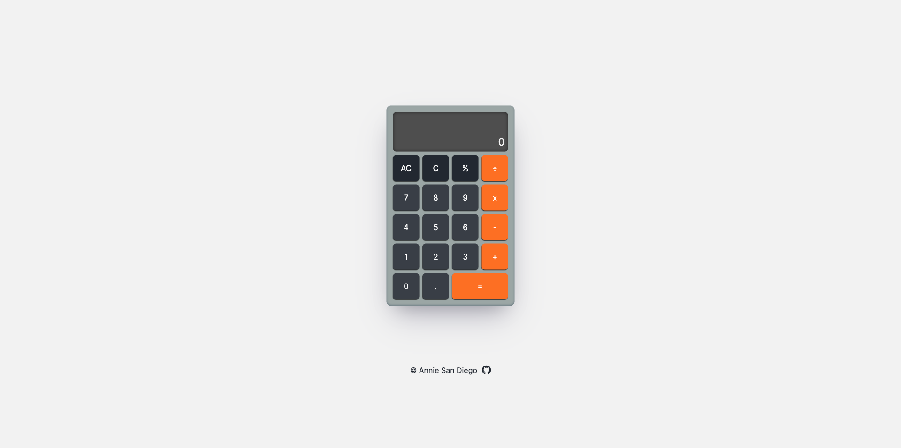

# The Odin Project - Calculator

This is a solution to the Calculator Project on [The Odin Project Foundations Course](https://www.theodinproject.com/lessons/foundations-calculator). It is a simple calculator built with JavaScript, CSS Grid, and HTML.

## Screenshot

## Links

- Live Site URL: [https://amsandiego.github.io/odin-calculator](https://amsandiego.github.io/odin-calculator)
